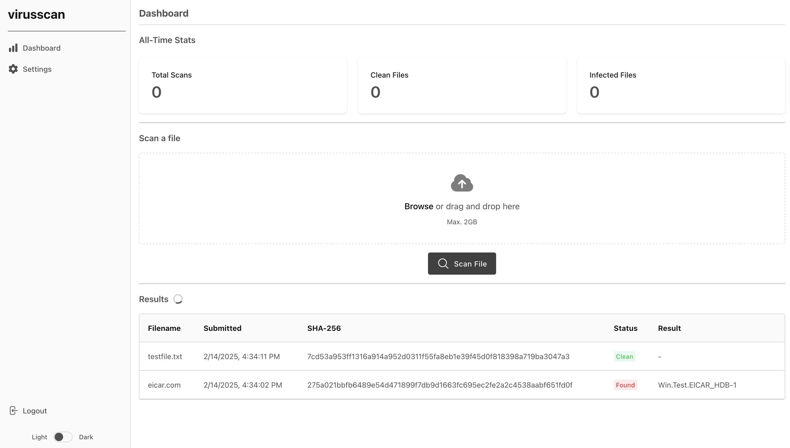

<div align="center">

</div>

# VirusScan Web

This is a web application to scan files for viruses using ClamAV.

<div align="center">

</div>

## Quick Start

### Running the Application

1. Clone the repository:

```bash
git clone https://github.com/security-dev/virusscan-web.git
```

2. Navigate to the project directory:

```bash
cd virusscan-web
```

3. Run the following command to run the application:

```bash
make run
```

### Credentials

Admin credentials should be printed to the console in the first time you run the application.

Example:

```
web-1     | !!! ADMIN CREDENTIALS !!!
web-1     | ╔═════════════════════════╗
web-1     | ║ Username: admin         ║
web-1     | ║ Password: xxxxxxxxxxxx  ║
web-1     | ╚═════════════════════════╝
```

### Settings

The application settings are stored in the `.env` file. You can copy the `.env.example` file and modify the settings as
needed.

### APIs

The application provides the following APIs:

- `/api/scans/`: List and create file scans
- `/api/user/api_keys/`: List and create API keys

#### API Documentation

You can access the API documentation by visiting the `/api/docs` URL.

## Deployment

You can deploy the application to a server using Docker.

## Tech stack

- Python 3.12
- Django
- django-ninja
- ClamAV
- Celery
- Redis
- Docker

## Development

To start the development environment, run the following commands:

```bash
make build
make start
```

This will build the development environment and start the containers. You'll need to set the `DEBUG` environment
variable to `True` in the `.env` file.

To generate the correct styles for the frontend, run the following command:

```bash
npx @tailwindcss/cli -i ./frontend/input.css -o ./static/css/styles.css --watch
```

To stop the containers, run the following command:

```bash
make stop
```

## Contributing

Contributions are welcome! Please follow these steps:

1. Fork the repository.
2. Create a new branch for your changes.
3. Make your changes and commit them.
4. Push your changes to your fork.
5. Create a pull request.

## License

This project is licensed under the Apache-2.0 License.